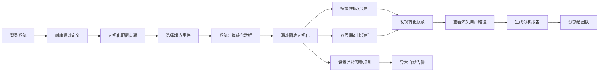
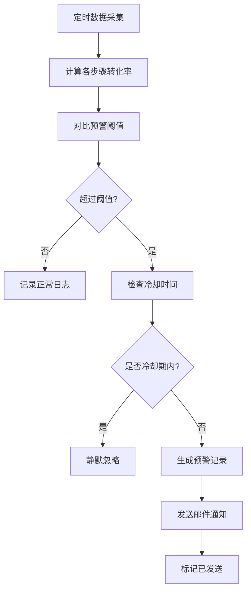

# 用户行为漏斗分析工具 PRD

## 1. 产品概述

用户行为漏斗分析工具是一款面向产品运营人员的自助式数据分析平台，帮助运营人员通过可视化界面定义转化漏斗、分析用户转化路径、对比不同用户群体差异，及时发现转化瓶颈并驱动产品优化。

- **核心价值**：降低数据分析门槛，让运营人员无需编写 SQL 即可完成复杂的漏斗分析，加速决策闭环
- **目标用户**：产品经理、运营专员、数据分析师、增长黑客

## 2. 核心功能

### 2.1 用户角色

| 角色 | 注册方式 | 核心权限 |
|------|----------|----------|
| 运营管理员 | 邮箱/SSO登录 | 漏斗管理、数据分析、报告创建、预警配置、用户管理 |
| 普通运营 | 邮箱/SSO登录 | 漏斗查看、数据分析、报告查看 |
| 团队成员（只读） | 分享链接访问 | 查看已分享的报告 |

### 2.2 功能模块

1. **仪表盘首页**：数据概览卡片、常用漏斗快捷入口、预警通知中心
2. **漏斗管理**：漏斗列表、漏斗创建/编辑、步骤可视化定义、埋点事件选择
3. **漏斗分析**：漏斗可视化图表、转化率/流失率计算、用户属性拆分、双周期对比
4. **流失分析**：流失用户列表、行为路径追溯、最后操作分析
5. **报告中心**：报告创建、报告列表、报告分享、权限管理
6. **监控预警**：预警规则配置、阈值设置、通知渠道管理、预警历史

### 2.3 页面详情

| 页面名称 | 模块名称 | 功能描述 |
|---------|---------|----------|
| 仪表盘 | 数据概览卡片 | 展示关键指标：活跃用户数、总转化数、平均转化率、预警数 |
| 仪表盘 | 常用漏斗快捷入口 | 卡片式展示最近访问/收藏的漏斗 |
| 仪表盘 | 预警通知中心 | 实时展示未处理的预警通知，可一键跳转分析 |
| 漏斗列表 | 搜索筛选栏 | 按名称、创建时间、标签筛选漏斗 |
| 漏斗列表 | 漏斗卡片列表 | 展示漏斗名称、步骤数、创建人、最近更新时间 |
| 漏斗创建 | 基本信息表单 | 漏斗名称、描述、标签、数据时间范围默认值 |
| 漏斗创建 | 步骤可视化编辑器 | 拖拽排序步骤、选择埋点事件、设置步骤名称、条件过滤配置 |
| 漏斗分析 | 漏斗主图表 | SVG 可视化漏斗图，展示每步用户数、转化率、流失率 |
| 漏斗分析 | 用户属性拆分器 | 支持按渠道/注册时间/城市/设备等多维度拆分，生成分组漏斗 |
| 漏斗分析 | 双周期对比 | 选择两个时间段，叠加或并排展示漏斗对比数据 |
| 漏斗分析 | 数据明细表格 | 展示每步详细数据：用户数、转化率、环比、同比 |
| 流失分析 | 流失用户列表 | 分页展示流失用户ID、流失时间、用户属性标签 |
| 流失分析 | 行为路径时间轴 | 可视化展示流失前N步操作，时间轴形式呈现 |
| 流失分析 | 高频流失操作统计 | 统计流失前最后一步的高频事件Top10 |
| 报告中心 | 报告列表 | 展示所有报告、支持搜索、按创建时间排序 |
| 报告中心 | 报告编辑页 | 富文本编辑、插入漏斗图表、添加文字说明、设置布局 |
| 报告中心 | 报告详情/分享页 | 只读模式展示报告内容、支持导出PDF/图片 |
| 监控预警 | 预警规则列表 | 展示所有监控规则、状态开关、最近触发时间 |
| 监控预警 | 规则创建/编辑 | 选择漏斗步骤、设置阈值类型（绝对值/环比）、设置告警阈值 |
| 监控预警 | 通知渠道配置 | 配置邮件接收人、邮件模板、发送频率限制 |

## 3. 核心流程

### 3.1 漏斗创建与分析流程

运营人员登录系统后，创建漏斗定义转化步骤，系统根据埋点数据计算转化数据，运营人员通过多维度拆分和周期对比深入分析，发现异常时追溯流失用户行为，最终生成报告分享给团队，同时设置监控预警实现自动化发现问题。

### 3.2 预警触发流程

## 4. 用户界面设计

### 4.1 设计风格

- **主色调**：深海蓝 `#1e3a5f` 作为主色，传达专业、数据驱动的信任感；辅助色为活力橙 `#ff7a45`，用于强调转化率、关键指标和预警
- **按钮风格**：圆角 8px，主按钮使用渐变色填充，悬停有微妙的上浮阴影效果
- **字体**：使用 `Outfit` 作为展示字体（标题、数字），`Inter` 作为正文字体，数字使用等宽字符 `font-variant-numeric: tabular-nums`
- **布局风格**：侧边栏导航 + 主内容区的经典 B 端布局，内容区采用卡片式分组，卡片有细微的边框和阴影
- **图标风格**：使用线性图标（Lucide），统一 24px 描边 1.5px 风格，关键操作图标添加色彩

### 4.2 页面设计概述

| 页面名称 | 模块名称 | UI 元素 |
|---------|---------|---------|
| 仪表盘 | 数据概览卡片 | 4 张渐变卡片，左图标右数字，数字有动态计数动画，下方显示环比小箭头 |
| 漏斗分析 | 漏斗主图表 | SVG 绘制的倒梯形漏斗，每步渐变色填充，hover 高亮并显示详细浮层，步骤间有转化率连线 |
| 漏斗分析 | 属性拆分面板 | 左侧可折叠的维度树，勾选后右侧生成多组迷你漏斗并列对比 |
| 流失分析 | 行为路径时间轴 | 垂直时间轴，节点带事件图标，hover 显示事件详情，流失节点红色高亮 |
| 报告中心 | 报告详情页 | 类 Notion 的页面布局，图表容器支持拖放调整大小，分享按钮固定右上角 |
| 监控预警 | 规则配置 | 滑块组件设置阈值，实时预览阈值线在历史趋势图上的位置 |

### 4.3 响应式设计

- 采用桌面优先设计，最小适配宽度 1280px
- 侧边栏在 < 1024px 时可折叠为图标模式
- 数据表格在小屏下可横向滚动，关键列固定
- 图表使用 SVG 矢量绘制，自适应容器宽度

### 4.4 动效与微交互

- 页面加载：侧边栏先入场，然后内容区卡片按顺序带淡入和轻微上移动画出现
- 漏斗图：首次加载时从第一步开始，每步按顺序执行宽度展开动画，营造数据流感
- 数字变化：指标更新时使用 requestAnimationFrame 平滑过渡数字
- Hover 效果：卡片 hover 时阴影加深 + 1px 上浮，按钮 hover 时渐变亮度提升
- 预警通知：顶部滑入式 Toast，高优先级预警带红色脉冲动画
