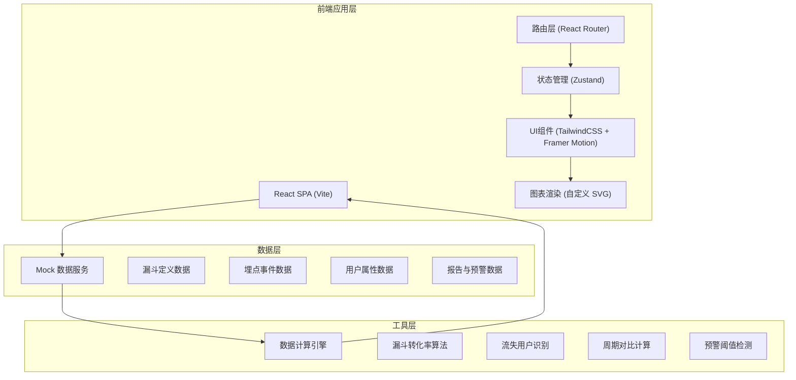
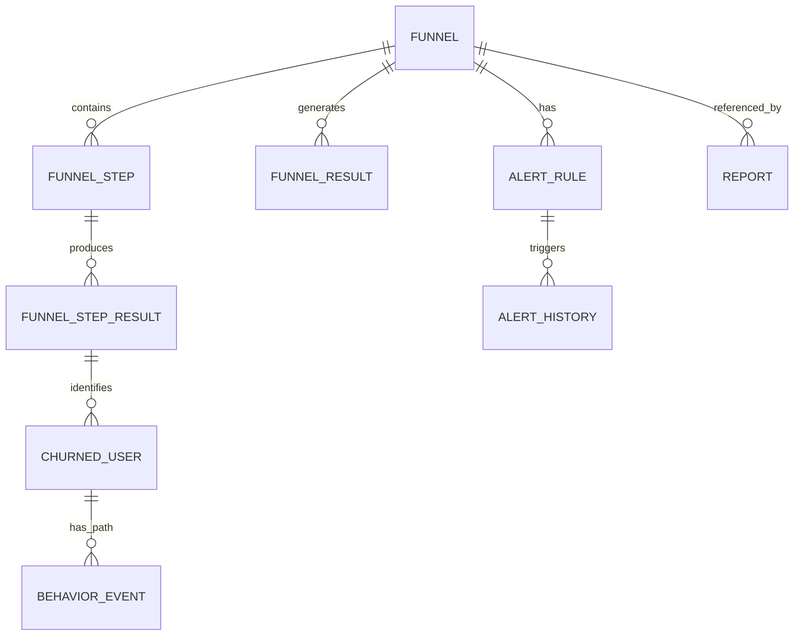

# 用户行为漏斗分析工具 技术架构文档

## 1. 架构设计



## 2. 技术栈说明

- **前端框架**：React@18 + TypeScript@5
- **构建工具**：Vite@5
- **样式方案**：TailwindCSS@3 + PostCSS
- **状态管理**：Zustand（轻量级，适合中型应用）
- **路由方案**：React Router@6
- **动画库**：Framer Motion（页面过渡、图表动画、微交互）
- **日期处理**：date-fns（轻量、Tree-shakable）
- **图标库**：Lucide React（线性图标，设计统一）
- **后端方案**：无后端，使用前端 Mock 数据服务（含 localStorage 持久化）
- **数据存储**：浏览器 localStorage + 内存数据

## 3. 路由定义

| 路由路径 | 页面名称 | 核心功能 |
|---------|---------|---------|
| `/` | 仪表盘首页 | 数据概览、快捷入口、预警通知 |
| `/funnels` | 漏斗列表 | 漏斗管理、搜索筛选 |
| `/funnels/new` | 创建漏斗 | 步骤可视化编辑器 |
| `/funnels/:id` | 漏斗分析页 | 漏斗图、属性拆分、周期对比 |
| `/funnels/:id/churn` | 流失分析页 | 流失用户列表、行为路径 |
| `/reports` | 报告列表 | 报告管理、搜索 |
| `/reports/:id` | 报告详情 | 报告查看、分享、导出 |
| `/alerts` | 监控预警 | 预警规则管理、通知配置 |

## 4. 核心数据类型定义

```typescript
// 漏斗定义
interface Funnel {
  id: string;
  name: string;
  description: string;
  tags: string[];
  steps: FunnelStep[];
  createdAt: string;
  updatedAt: string;
  createdBy: string;
  isFavorite: boolean;
}

interface FunnelStep {
  id: string;
  name: string;
  eventName: string;
  order: number;
  filter?: FilterCondition[];
}

interface FilterCondition {
  field: string;
  operator: 'eq' | 'ne' | 'in' | 'gt' | 'lt' | 'contains';
  value: string | number | string[];
}

// 漏斗计算结果
interface FunnelResult {
  funnelId: string;
  period: { start: string; end: string };
  steps: FunnelStepResult[];
  totalConversionRate: number;
}

interface FunnelStepResult {
  stepId: string;
  stepName: string;
  userCount: number;
  conversionRate: number; // 相对上一步
  overallConversionRate: number; // 相对第一步
  dropOffCount: number;
  dropOffRate: number;
}

// 用户属性维度
interface UserDimension {
  field: 'channel' | 'city' | 'device' | 'registerDate' | 'userLevel';
  label: string;
  values: string[];
}

// 流失用户
interface ChurnedUser {
  userId: string;
  userProperties: {
    channel: string;
    city: string;
    registerDate: string;
    device: string;
  };
  lastStepId: string;
  churnedAt: string;
  behaviorPath: BehaviorEvent[];
}

interface BehaviorEvent {
  eventName: string;
  eventLabel: string;
  timestamp: string;
  properties?: Record<string, any>;
}

// 报告
interface Report {
  id: string;
  title: string;
  funnelId?: string;
  contentBlocks: ReportBlock[];
  createdAt: string;
  updatedAt: string;
  createdBy: string;
  shareToken?: string;
  isShared: boolean;
}

type ReportBlock = 
  | { type: 'text'; content: string }
  | { type: 'heading'; level: 1 | 2 | 3; content: string }
  | { type: 'funnel-chart'; funnelId: string; config: any }
  | { type: 'metric-card'; metric: string; value: number; trend: number };

// 预警规则
interface AlertRule {
  id: string;
  funnelId: string;
  stepId: string;
  name: string;
  thresholdType: 'absolute' | 'relative'; // 绝对值/环比
  threshold: number; // e.g. 0.1 表示下降10%
  checkInterval: 'daily' | 'hourly';
  contacts: AlertContact[];
  isEnabled: boolean;
  lastTriggeredAt?: string;
  coolDownMinutes: number;
}

interface AlertContact {
  name: string;
  email: string;
}

interface AlertHistory {
  id: string;
  ruleId: string;
  triggeredAt: string;
  actualValue: number;
  threshold: number;
  message: string;
  isRead: boolean;
}
```

## 5. 数据模型关系图



## 6. 核心算法说明

### 6.1 漏斗转化率计算
1. **严格有序模式（默认）**：用户必须按步骤顺序完成事件才计入，前一步未完成则后续步骤不计入
2. 对每个用户的事件序列按时间排序
3. 匹配第一个步骤事件作为起点
4. 后续步骤必须在时间上晚于前一步骤
5. 逐步统计各步骤用户数，计算转化率 = 当前步用户数 / 上一步用户数

### 6.2 流失用户识别
- 在第 N 步有行为记录、但在第 N+1 步无任何匹配事件的用户
- 记录流失前最近的 10-20 条行为事件作为行为路径

### 6.3 周期对比算法
- 支持自定义两个对比周期（如 本周 vs 上周）
- 计算每个步骤的差值和变化百分比
- 变化率超过阈值的步骤用红色/绿色高亮显示

## 7. 目录结构设计

```
src/
├── assets/                # 静态资源
├── components/            # 通用组件
│   ├── ui/               # 基础UI组件
│   │   ├── Card.tsx
│   │   ├── Button.tsx
│   │   ├── Modal.tsx
│   │   ├── Tabs.tsx
│   │   ├── Select.tsx
│   │   ├── DatePicker.tsx
│   │   ├── Slider.tsx
│   │   └── Tag.tsx
│   ├── layout/           # 布局组件
│   │   ├── Sidebar.tsx
│   │   ├── Header.tsx
│   │   └── AppLayout.tsx
│   └── funnel/           # 漏斗专用组件
│       ├── FunnelChart.tsx
│       ├── FunnelEditor.tsx
│       ├── DimensionSplitter.tsx
│       ├── PeriodCompare.tsx
│       └── BehaviorTimeline.tsx
├── pages/                # 页面组件
│   ├── Dashboard.tsx
│   ├── FunnelList.tsx
│   ├── FunnelCreate.tsx
│   ├── FunnelAnalysis.tsx
│   ├── ChurnAnalysis.tsx
│   ├── ReportList.tsx
│   ├── ReportDetail.tsx
│   └── AlertCenter.tsx
├── store/                # Zustand 状态管理
│   ├── funnelStore.ts
│   ├── reportStore.ts
│   └── alertStore.ts
├── services/             # 数据服务
│   ├── mockData.ts       # Mock 数据生成
│   ├── funnelService.ts  # 漏斗计算服务
│   └── localStorage.ts   # 持久化工具
├── types/                # TypeScript 类型定义
│   └── index.ts
├── utils/                # 工具函数
│   ├── calculation.ts    # 计算相关
│   ├── date.ts           # 日期处理
│   └── format.ts         # 格式化
├── App.tsx
├── main.tsx
└── index.css
```

## 8. 前端 UI 组件详细说明

### 8.1 FunnelChart（漏斗图组件）
- 使用原生 SVG 绘制，避免引入大型图表库
- 每步宽度按用户数比例计算，使用线性渐变填充
- 步骤之间用折线连接，标注转化率百分比
- 支持 hover 高亮，点击步骤进入流失分析
- 首屏加载时使用 framer-motion 做每步宽度展开动画

### 8.2 BehaviorTimeline（行为时间轴）
- 垂直时间轴布局，左侧时间、右侧事件
- 每个事件节点带事件类型图标和颜色
- 最后一个事件（流失点）使用红色脉冲动画标记
- 支持展开/收起单条路径的详细属性
